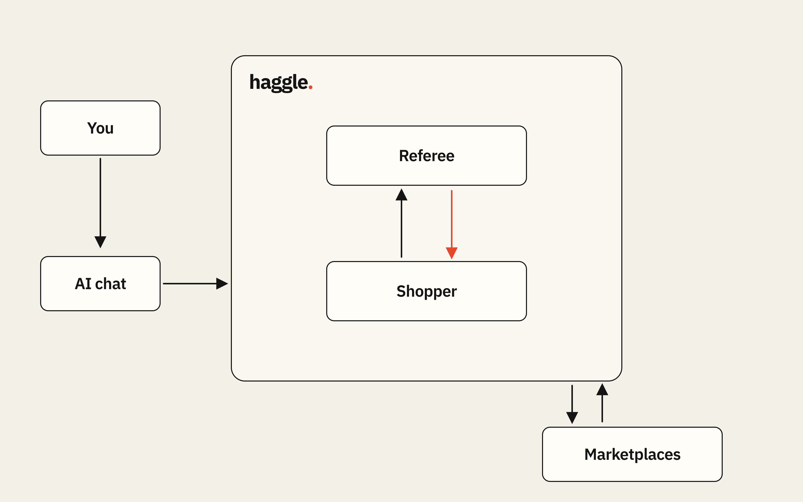

# haggle.

**Your agent finds it, vets it, and haggles for it.**



## The problem

Buying second-hand is cheaper and better for the planet, but it's a pain:

- dozens of messy listings, in Swedish and English
- specs that are missing or wrong
- scams that look like bargains
- haggling with strangers, one chat at a time

## Our solution

Describe what you want in one sentence, typed or spoken. haggle searches the marketplace, reads and
vets every listing, flags scams and shows you the best fits. Once you approve, it negotiates with
several sellers in parallel. Nothing is sent and nothing is bought without your OK.

Two parts, kept strictly apart:

- **Shopper** – a Gemini agent that searches, reads listings and haggles.
- **Referee** – plain code that checks every move the Shopper proposes: budget cap, no false claims,
  message limits, and your approval before anything is sent.

You can use haggle from an AI chat (Gemini CLI, Claude Code, Codex via MCP) or from our own web page.

## Try it

**Web page:** https://haggle-p61s.onrender.com/

It runs on a free instance, so the first visit after a quiet spell can take about a minute to wake up.
Add `?replay=1` to watch a recorded hunt.

**From your AI chat (MCP):** connect haggle and just ask for what you want.

```bash
# Gemini CLI (extension: MCP connection + shopping skill + /haggle command)
gemini extensions install https://github.com/Zawaer/haggle

# Claude Code (plugin: MCP connection + shopping skill)
claude plugin marketplace add Zawaer/haggle
claude plugin install haggle@haggle-marketplace --scope user

# or add the MCP server directly
claude mcp add --transport http haggle https://haggle-p61s.onrender.com/mcp/
gemini mcp add --scope user --transport http --timeout 600000 haggle https://haggle-p61s.onrender.com/mcp/
codex mcp add haggle --url https://haggle-p61s.onrender.com/mcp/
```

Then ask:

> "Use haggle to find me a used gaming PC under 8,000 kr in Stockholm, at least an RTX 3060."

Your agent starts a hunt, sends you a link to watch it live, and asks you before contacting sellers
and before confirming a deal. [Setup, updates and troubleshooting](docs/mcp.md).

## Tech

- **Google Gemini** (Interactions API, `google-genai`): intake, listing extraction, buyer agent,
  simulated sellers, voice input (Gemini Transcribe)
- **MCP** server (streamable HTTP), so any AI chat can use haggle as a tool
- **Python + FastAPI**, Server-Sent Events for the live dashboard, asyncio for parallel negotiations
- **Vanilla HTML/CSS/JS** web page, no build step
- **Matrix OS** – the always-on cloud computer haggle runs on (see below)
- **condense.chat** – shrinks the negotiation context (see below)
- **mockbay** – our mock second-hand marketplace with simulated sellers (no real purchases or messages)

### Matrix OS: the agent keeps working while your laptop is closed

haggle runs on our Matrix OS cloud computer, an always-on machine. That matters because a hunt
doesn't end with the first deals: in **watch mode** haggle keeps checking the marketplace every 15 s
for up to 3 hours. When a new matching listing appears, it is read, vetted and scam-checked, and the
agent drafts a message and waits for your approval. You can close your laptop; the hunt keeps going.

### condense.chat: smaller prompts for the negotiator

Before every move the buyer agent makes, haggle sends the listing text and the chat history older than
the last two messages through condense.chat. The latest messages stay word for word, and listing
extraction is never compressed (condense is lossy).

In our test (same request, 10 runs with and 10 without, 40 deals each way):

| | Without condense | With condense |
|---|---|---|
| Negotiation context sent to Gemini | 103,007 chars | 81,415 chars (**−21.0%**) |
| Share of possible discount won | 97.9% | 98.8% |
| Average saved per deal | 902 kr | 916 kr |
| Deals over budget | 0 | 0 |
| Gemini calls per hunt | 78 | 79 |

So: about 21% less negotiation context, with no loss in deal quality. The context size is measured by haggle
(characters before and after each `/v1/compress` call, 61 calls). Listing reading isn't compressed, so total
Gemini usage falls by less. Per run the compression was steady (19–22%). The sellers are simulated and the discount difference is
within run-to-run noise, so read it as "no quality loss observed".

## Team

Oskar, Songhua, Toivo, Wilmer, Rene. Built at the {Tech: Europe} × Google DeepMind Agentic AI Hack,
Stockholm, 3 October 2026.
